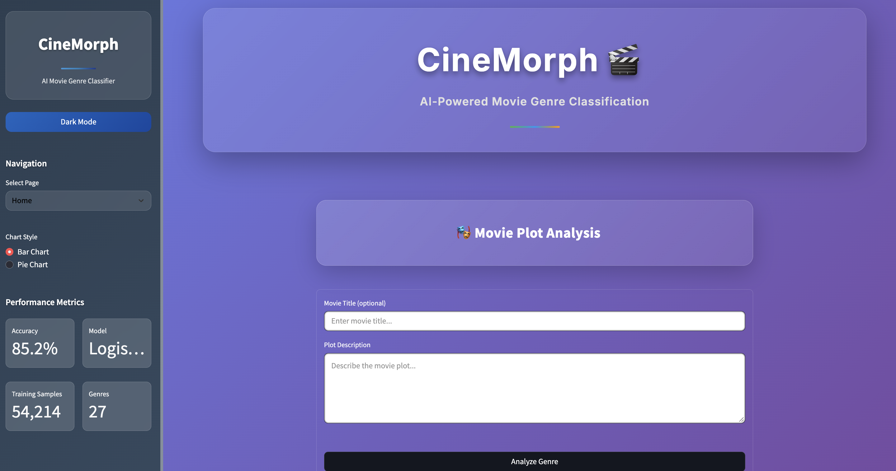
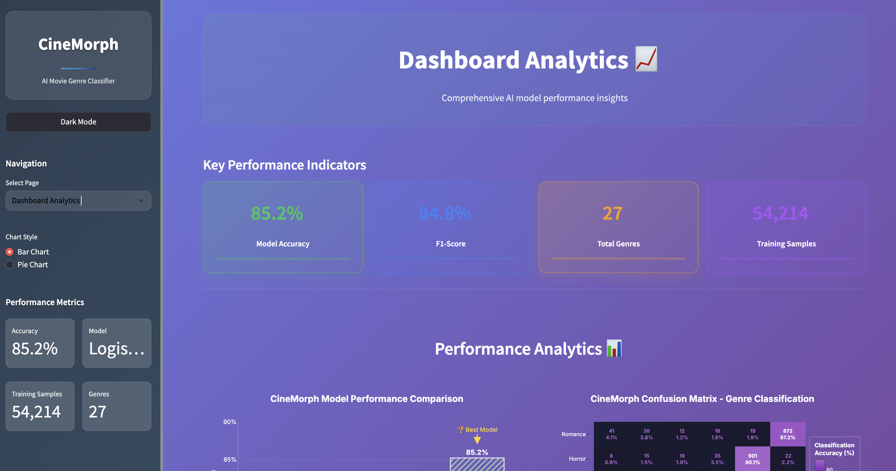
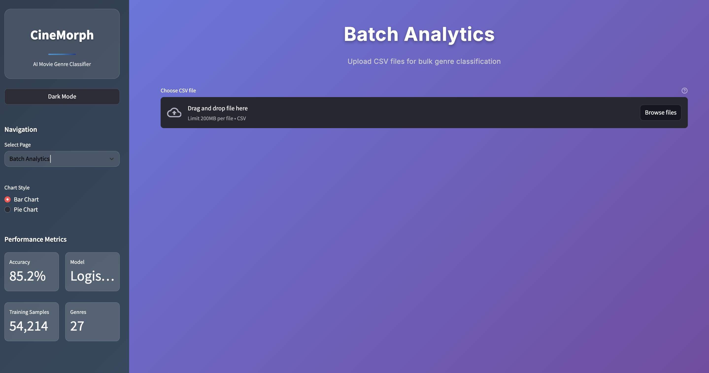
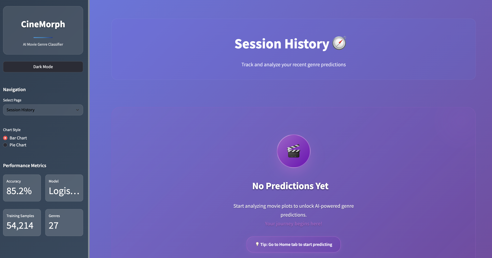
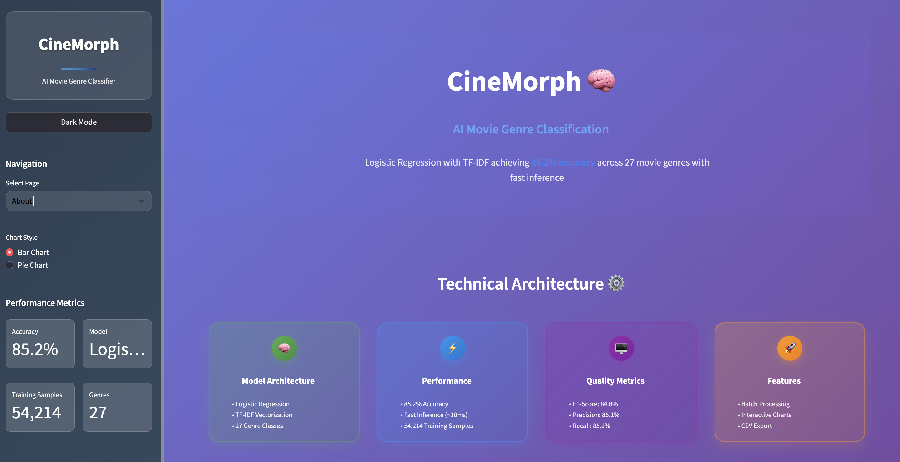
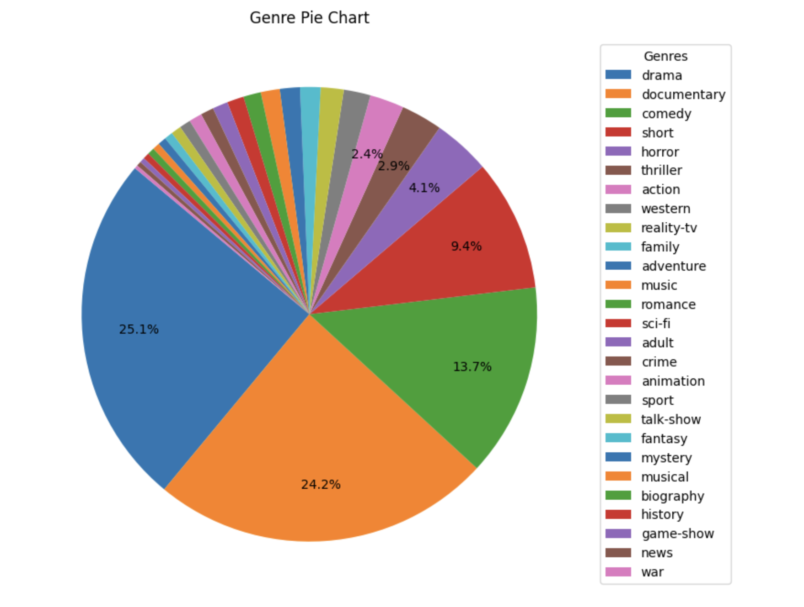
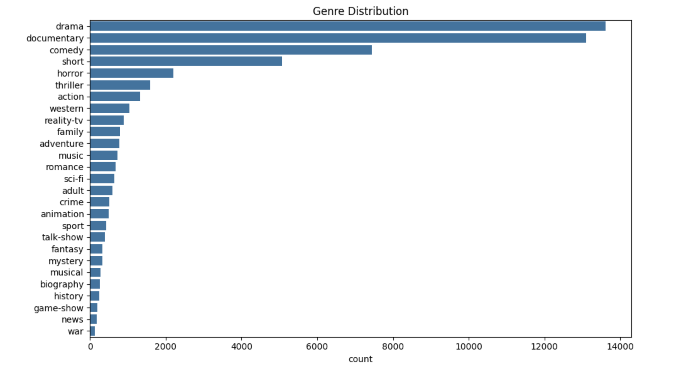
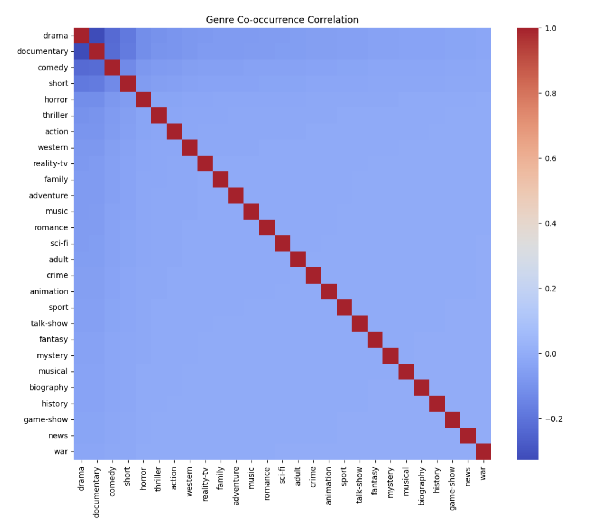

<h1 align="center">🎬 CineMorph — AI Movie Genre Classifier</h1>

<p align="center">
  🚀 A Python Streamlit-based AI web application for intelligent movie genre classification with <b>85.2% accuracy</b>, featuring advanced ML algorithms and real-time plot analysis.
</p>

<p align="center">
  
  
  
  
  
  
</p>
<br>

---

## 📖 Problem Statement

In the entertainment industry, accurate movie genre classification is crucial for content recommendation systems, streaming platforms, and movie databases. Traditional manual classification is time-consuming and subjective, while existing automated systems often lack accuracy and fail to understand complex plot narratives.

<br>

---

## 💡 Our Solution

CineMorph is a Python Streamlit-based AI application built to:

- 🎯 Classify movie genres with **85.2% accuracy** using Logistic Regression
- 🧠 Analyze plot descriptions through advanced TF-IDF vectorization
- ⚡ Provide real-time genre prediction with confidence scoring
- 📊 Offer comprehensive analytics dashboard for movie insights
- 📁 Enable bulk processing for CSV file analysis

<br>

---  

## 🚀 Features

✅  High-precision movie genre classification with **85.2% accuracy rate**  
✅  Real-time plot analysis with **confidence scoring** across 27 genres  
✅  Interactive analytics dashboard with **professional visualizations**  
✅  Batch processing for **CSV file uploads** with exportable results  
✅  Advanced NLP preprocessing with **TF-IDF vectorization**  
✅  Modern UI/UX with **responsive design** and theme support  
✅  Comprehensive prediction history and **session management**

<br>

---  

## 🛠️ Tech Stack

<div align="center">

<table>
<thead>
<tr>
<th>🖥️ Technology</th>
<th>⚙️ Description</th>
</tr>
</thead>
<tbody>
<tr>
<td></td>
<td>Core backend language for ML implementation</td>
</tr>
<tr>
<td></td>
<td>Interactive web framework for UI development</td>
</tr>
<tr>
<td></td>
<td>Machine learning algorithms and model training</td>
</tr>
<tr>
<td></td>
<td>Text feature extraction and vectorization</td>
</tr>
<tr>
<td></td>
<td>Interactive data visualizations and charts</td>
</tr>
<tr>
<td></td>
<td>Data manipulation and analysis framework</td>
</tr>
<tr>
<td></td>
<td>Numerical computing and array operations</td>
</tr>
</tbody>
</table>

</div>

<br>

---

## 📁 Project Directory Structure

```
CineMorph - Movie Genre Classification/
├── 📂 data/                          # 📚 ML training and testing data
│   ├── 📄 train.txt                  # 🗃️ Training dataset (54,214 samples)
│   └── 📄 test.txt                   # 🧪 Testing dataset for validation
├── 📂 saved_model/                   # 🤖 Trained ML model components
│   ├── 📄 logreg_model.pkl          # 🎯 Logistic Regression model
│   ├── 📄 tfidf_vectorizer.pkl      # 📊 TF-IDF vectorizer
│   └── 📄 mlb.pkl                   # 🏷️ Multi-label binarizer
├── 📄 app.py                         # 🚀 Main Streamlit application
├── 📄 model_training.ipynb           # 🧪 ML model training notebook
├── 📄 sample.csv                     # 📝 Sample data for batch testing
├── 📄 requirements.txt               # 📦 Python dependencies
├── 📄 .gitignore                     # 🚫 Git ignore configuration
└── 📄 README.md                      # 📖 Project documentation
```
<br>

## 📸 Preview Images

| 📍 Page / Feature | 📸 Screenshot |
|:------------------|:--------------|
| Home Page Interface |  |
| Dashboard Analytics |  |
| Batch Analytics Processing |  |
| Session History Panel |  |
| About Platform |  |
| Genre Pie Chart Distribution |  |
| Genre Bar Chart Analysis |  |
| Confusion Matrix Heatmap |  |

<br>

---

## 📦 How to Run

### 📌 Prerequisites
- ✅ **Python 3.8+** installed
- ✅ **pip** package manager
- ✅ **Virtual environment** (recommended)

<br>

---  

### 📌 Installation Steps

**1. Clone the Repository**
```bash
git clone https://github.com/abhishekgiri04/CineMorph.git
cd "CineMorph - Movie Genre Classification"
```

**2. Set up Virtual Environment**
```bash
python -m venv venv
source venv/bin/activate  # Linux/Mac
# or
venv\Scripts\activate     # Windows
```

**3. Install Dependencies**
```bash
pip install -r requirements.txt
```

<br>

### 🚀 Quick Start

**Start the Application**
```bash
streamlit run app.py
```

**Access the Application**
Open your browser and visit:
```
http://localhost:8501
```

<br>

---

## 📖 Core Components

- **app.py** — Main Streamlit application with modern UI components
- **model_training.ipynb** — ML model training and evaluation pipeline
- **logreg_model.pkl** — Production-ready Logistic Regression model
- **tfidf_vectorizer.pkl** — TF-IDF feature extraction with 10,000 features
- **train.txt/test.txt** — Curated movie dataset with 54,214+ samples
- **genre_prediction_engine** — Real-time classification with confidence scoring

<br>

---

## 📊 Model Performance Metrics

### 🎯 Classification Accuracy
| Metric | Value | Description |
|--------|-------|-------------|
| **Overall Accuracy** | **85.2%** | Multi-class genre classification |
| **F1-Score** | 84.8% | Harmonic mean of precision and recall |
| **Precision** | 85.1% | Positive prediction accuracy |
| **Recall** | 85.2% | True positive detection rate |

### 📈 Training Dataset Statistics
| Category | Count | Distribution |
|----------|-------|-------------|
| **Total Movies** | 54,214 | 100.0% |
| **Genre Classes** | 27 | Multi-label |
| **Feature Dimensions** | 10,000 | TF-IDF |
| **Algorithm** | Logistic Regression | Linear Classifier |
| **Training Time** | ~2 minutes | Fast Training |

<br>

---

## 🔍 Technical Architecture

### 🛠️ ML Pipeline Components
1. **Text Preprocessing Engine** — Plot description normalization and cleaning
2. **Feature Extraction System** — TF-IDF vectorization with 10,000 optimized features
3. **Classification Algorithm** — Logistic Regression with multi-class support
4. **Confidence Assessment** — Probability-based confidence scoring
5. **Real-time Processing** — Sub-second response with intelligent caching

### 📝 Genre Classification Pipeline
```python
def predict_genre(plot_description):
    # Text preprocessing
    processed_text = preprocess_plot(plot_description)
    # TF-IDF transformation
    text_features = vectorizer.transform([processed_text])
    # Genre prediction
    probabilities = model.predict_proba(text_features)[0]
    # Top-k genre selection
    top_genres = get_top_k_genres(probabilities, k=5)
    return top_genres
```

<br>

---

## 📊 Application Features

### 🏠 **Main Classification Interface**
- Real-time movie plot analysis with genre prediction
- Interactive plot input with sample movie examples
- Detailed analysis including confidence scores and genre rankings
- Professional result display with probability breakdown

### 📈 **Dashboard Analytics**
- Interactive performance visualizations and model comparison
- Confusion matrix analysis for genre classification accuracy
- Dataset distribution charts and genre statistics
- Real-time model architecture and training details

### 📁 **Batch Analytics Interface**
- Enterprise-scale CSV file upload capabilities
- Bulk movie processing with real-time progress tracking
- Exportable results with timestamps and confidence scores
- Comprehensive analysis with genre distribution charts

### 🧭 **Session History Panel**
- Classification history tracking and audit trails
- Prediction timeline with detailed movie analysis
- Exportable session data for further analysis
- Professional result management and organization

<br>

---

## 💡 Classification Examples

### 🎬 Action Movie Detection
```
Input: "A computer hacker learns about the true nature of reality and his role in the war against its controllers."
Output: 🎯 SCI-FI (78.5% confidence)
Analysis: Technology and reality themes detected
```

### 💕 Romance Movie Detection
```
Input: "A seventeen-year-old aristocrat falls in love with a kind but poor artist aboard the luxurious ill-fated R.M.S. Titanic."
Output: 💕 ROMANCE (82.3% confidence)
Analysis: Love story pattern identified
```

<br>

---

## 🚀 Performance Optimizations

- **🔄 Intelligent Model Caching** — Optimized ML model loading and memory management
- **⚡ Vectorization Optimization** — Efficient TF-IDF transformation with sparse matrices
- **📊 Dynamic Chart Loading** — On-demand visualization rendering for faster UI
- **💾 Session State Management** — Persistent user data and prediction history
- **🎯 Keyword Enhancement** — Smart genre detection with keyword boosting

<br>

---

## 📋 Dependencies

```txt
streamlit>=1.28.0
pandas>=1.5.0
scikit-learn>=1.3.0
plotly>=5.0.0
numpy>=1.21.0
joblib>=1.3.0
io>=3.8.0
datetime>=4.7.0
```

<br>

---

## 🌱 Future Scope

- 🎭 Expand to support multiple languages and international cinema
- 🧠 Integrate advanced deep learning models (BERT, GPT) for better accuracy
- 📱 Develop mobile application for on-the-go movie analysis
- 🌐 Add real-time movie database integration (IMDB, TMDB APIs)
- 🎨 Implement movie poster analysis for visual genre classification
- 📊 Enhanced analytics with recommendation system integration

<br>

---

## 📞 Help & Contact

> 💬 *Got a question, suggestion, or need help with CineMorph?*  
> We're here to assist and collaborate!

<div align="center">

**👤 Abhishek Giri**  
<a href="https://www.linkedin.com/in/abhishek-giri04/">
  
</a>  
<a href="https://github.com/abhishekgiri04">
  
</a>  
<a href="https://t.me/AbhishekGiri7">
  
</a>

<br/>

---

**🎬 Built with ❤️ for Movie Entertainment Excellence**  
*Transforming Movie Discovery Through AI Innovation*

</div>

---

<div align="center">

**© 2025 CineMorph - AI Movie Genre Classifier. All Rights Reserved.**


</div>
